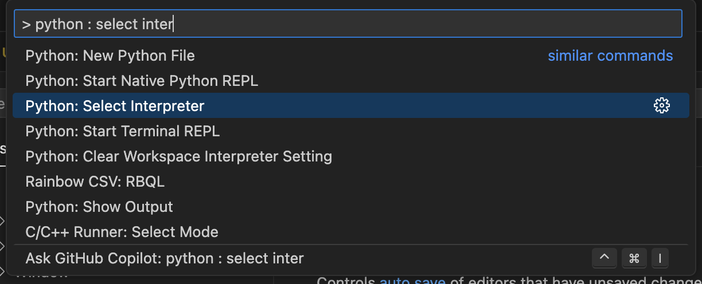
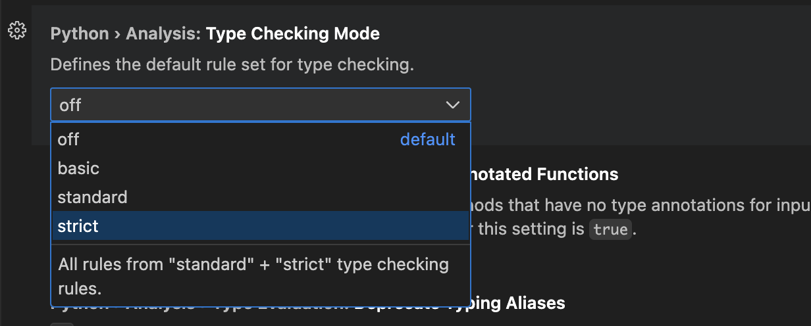
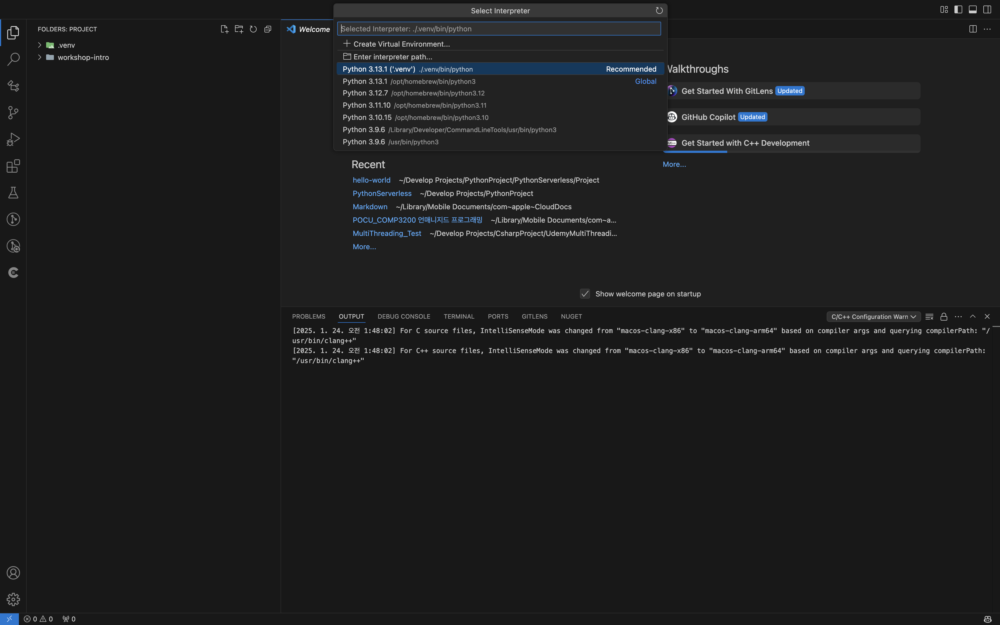
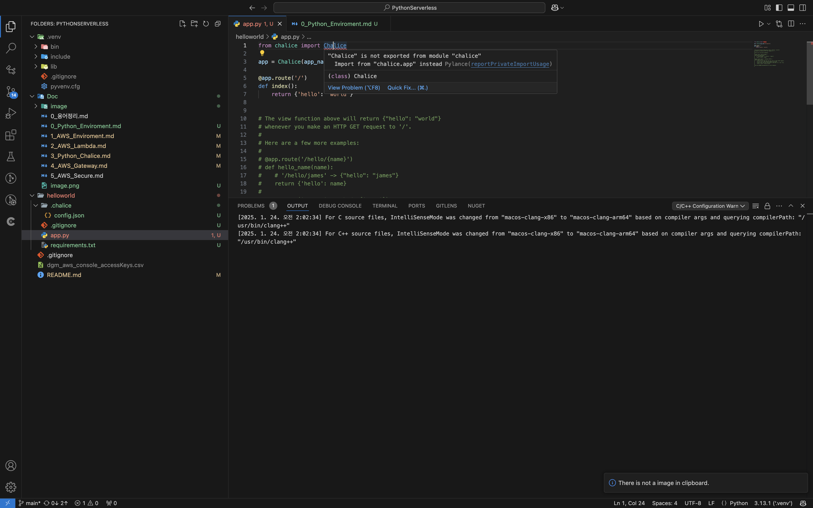

## 🍷 0 파이썬 .vend 세팅

---
 
### 파이썬 인터프리터 선택


---
 
### Pylance 확장 설정


```json
"python.analysis.typeCheckingMode": "strict",
"python.languageServer": "Pylance"
```

---
 
### 의존성 관리를 위한 .venv 설정

`cd Projects/PythonProject/PythonServerless/Project/hello-world`

#### 1). 가상환경 생성

```bash
python -m venv .venv
```

#### 2). 가상환경 활성 
```bash
source .venv/bin/activate
```


#### 3). 파이선 환경 확인
```bash
which python
/PythonProject/PythonServerless/Project/hello-world/.venv/bin/python

python -V
Python 3.13.1
```

#### 4). 패키지 설치
컴퓨터 클로벌 파이썬 실행과 독립적인 환경을 설정이 가능합니다.
```bash
pip list
Package Version
------- -------
pip     24.3.1
```

```bash
pip install setuptools
pip show setuptools
pip install requests  
pip show requests

> 설치된 위치 확인 가능
...
Location: .../PythonProject/PythonServerless/Project/hello-world/.venv/lib/python3.13/site-packages
...
```

#### 5). 가상 환경 빠져나오기

```bash
deactivate
```

#### 6). `requirements.txt`로 의존성 관리
이미 몇몇 라이브러리를 설치했으니 다음을 입력
```bash
pip freeze > requirements.txt
```

---
 
### 모듈 에러 해결

> is not exported from module python
    

[pylance : reportPrivateImportUsage](https://github.com/microsoft/pylance-release/issues/2953)

```json
"python.languageServer": "Pylance",
"python.analysis.showOnlyDirectDependenciesInAutoImport": true,
"python.analysis.diagnosticSeverityOverrides": {
    "reportPrivateImportUsage": "none"
}
```
