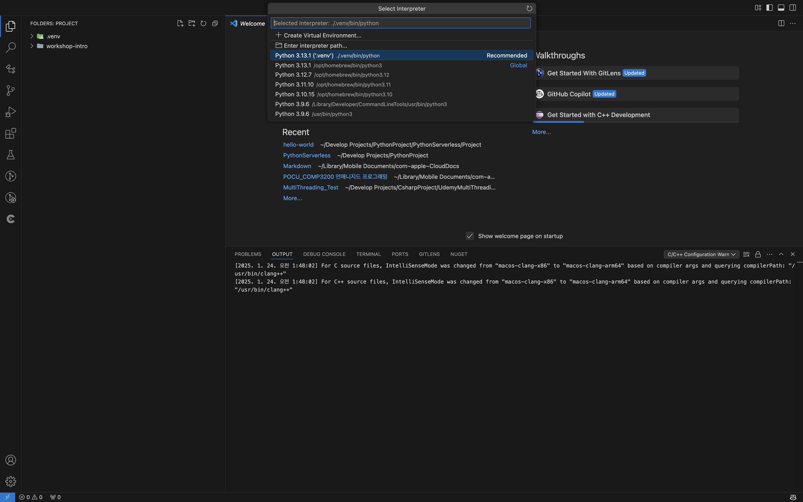

## 🍷 0 파이썬 .venv 세팅

---
 
### 파이썬 인터프리터 선택




---
 
### Pylance 확장 설정


```json
"python.analysis.typeCheckingMode": "strict",
"python.languageServer": "Pylance"
```

---
 
### 의존성 관리를 위한 .venv 설정

`cd Projects/PythonProject/PythonServerless/Project/hello-world`

#### 1). 가상환경 생성

* `<python_cli> -m venv <venv_directory_name>`
    ```bash
    python -m venv .venv
    ```

#### 2). 가상환경 활성 
* 컴퓨터 클로벌 파이썬 실행과 독립적인 환경을 설정이 가능합니다.
    ```bash
    source .venv/bin/activate
    ```

#### 3). 파이선 환경 확인

* `which python` : 이것으로 현재 개발환경이 "전역 환경" 인지, "가상 환경"인지 확인 가능
    ```bash
    which python
    /PythonProject/PythonServerless/Project/hello-world/.venv/bin/python

    python -V
    Python 3.13.1
    ```

#### 4). 패키지 설치

* `pip list` : 설치된 패키지 리스트로 확인
    ```bash
    pip list
    Package Version
    ------- -------
    pip     24.3.1
    ```
* `pip show <package_name>` : 설치된 패키지의 정보 (위치 등등..)
    ```bash
    pip install setuptools
    pip show setuptools
    pip install requests  
    pip show requests

    > 설치된 위치 확인 가능
    ...
    Location: .../PythonProject/PythonServerless/Project/hello-world/.venv/lib/python3.13/site-packages
    ...
    ```

#### 5). 가상 환경 빠져나오기

* __
    ```bash
    deactivate
    ```

#### 6). `requirements.txt`로 의존성 관리

* 이미 몇몇 라이브러리를 설치했으니 다음을 입력
    ```bash
    pip freeze > requirements.txt
    ```

---
 
### 모듈 에러 해결

> is not exported from module python
    

* **[pylance : reportPrivateImportUsage](https://github.com/microsoft/pylance-release/issues/2953)**
    ```json
    "python.languageServer": "Pylance",
    "python.analysis.showOnlyDirectDependenciesInAutoImport": true,
    "python.analysis.diagnosticSeverityOverrides": {
        "reportPrivateImportUsage": "none"
    }
    ```

--- 

### 문법 정리

* **[쉬운 파이썬](https://wikidocs.net/192016)**