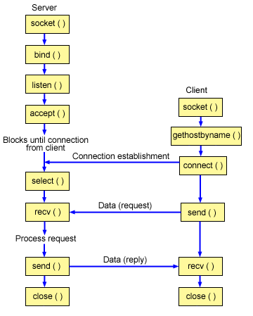

## 🌐 네트워크 API

* **API와 프로토콜을 혼동해서는 안된다.**
  ```
  프로토콜은 네트워크로 데이터를 교환하기 위해 사용하는 통신 규칙과 약속.
  API는 개발자가 프로그래밍적으로 접근할 수 있는 인터페이스 
    프로그램 백엔드에서 프로그램 프론트 엔드와 통신하기 위한 일반적인 매커니즘이기도 하다.
    이 API 라는 것이 없다면 서로 통신 방법에 대해 구축이 없다는 의미
  ```

---
 
> ### 📄 1. REST(REpresentational State Transfer) API

##### ① HTTP 프로토콜을 통해 "자원을 URL로 해석하고", "HTTP 메서드로 자원의 행위를 결정한다."
* **자원** : 사용자 정보, 게시물, 댓글 등이 자원이 될 수 있습니다.
* **HTTP 메서드** : (GET, POST, PUT, DELETE 등)
  * **HTTP 메서드 Idempotence 멱등성** : 한번 실행한거랑 두번이상 실행한거랑 결과가 같다고
    1. POST는 상태가 변할 수 있으므로 Idempotence하지 않고,
    2. PUT, GET, DELETE는 한번 호출하나 여러번 호출하나 결과가 같으므로 Idempotence하다


##### ② 그 URL의 패턴 매칭으로 의미있는 동작을 수행하려고 하는 규칙임
* **자원의 식별(URI)**: `/users/1`, `/articles/10/comments` 등
* **자원 교환의 형식**: JSON, XML 등으로 요청/응답
* **메서드를 통한 행위 명시(Uniform Interface)**
  `GET(조회)`, `POST(생성)`, `PUT/PATCH(수정)`, `DELETE(삭제)` 등
* **사용 예시**
  1. DB에 제품 추가
  3. 블로그 게시물 검색, 삭제

##### ③ 비 연결형 상태비저장(Stateless) `클라이언트 서버의 request/response (요청/응답)` 통신을 사용한다.
  * REST Server: API를 제공하고 비즈니스 로직 처리 및 저장을 책임진다.
  * Client(브라우저):  사용자 인증이나 context(세션, 로그인 정보) 등을 직접 관리하고 책임진다.

##### ④ 이러한 RESTful API를 생성하는 방법은 "API Gateway"를 이용하면 된다.

* [The RESTful Pokémon API](https://pokeapi.co/#google_vignette)

---
 
> ### 📄 2. RPC (Remote Procedure Call) API

##### ① HTTP프로토콜을 사용하며 클라이언트가 서버의(혹은 그 반대로) "프로시저 & 함수" 를 <br> 마치 본인의 컴퓨팅 자원인것 처럼 호출할때 사용하는 통신 기술
* **프로시저, 함수** : 종단점 함수에 대해 원격 함수를 호출하게 된다. 로컬 함수와 같이 패러미터를 전송한다.
* **HTTP 메서드** : `HTTP POST` 메서드를 사용 
요청의 예제는 `cURL` 혹은 `JSON Content-Type`으로 보낼 수 있다.
* **자원 교환의 형식**
  * `JSON / Protocol Buffer(Binary)` 형식으로 자원 교환한다 *(매개변수 전달도!)*
    ```json
    /* Content-Type */
    method    // 호출하려는 원격 프로시저의 이름을 나타냄
      혹은 구현에 따라 json에 표기가 아닌 routing으로 메서드를 명시할수 도 있음 
    params    // 원격 프로시저에 전달할 매개변수를 포함하는 빌드
    id        // 요청을 식별하기 위한 고유한 식별자.
    result    // 원격 프로시저의 실행 결과를 나타냄
    error     // 원격 프로시저 실행중 발생한 오류 정보
    ```

* **사용 예시** 
  1. 원격 디바이스의 카메라로 사진 찍기, 동영상 스트리밍
  2. 머신러닝 학습
  3. 뱅킹 시스템에서 한 계좌에서 다른 계좌로 자금 이체
  4. 원격으로 서버 재시작
  5. 많은 양의 데이터 로드

##### ② RPC 동기화
* "동기화 하는건 좀 그렇고(?)" 라는 누군가의 이야기가 있긴 한데
아무리 봐도 서버-클라이언트간 동기화 목적으로도 사용 하는거 맞다.
  ```
  그렇기 때문에 플레이어의 특정 행동같은 기능을 하는 함수는 모든 클라이언트에서 동일하게 표시되어야 하니까 
  RPC를 통해서 모든 클라이언트에게 "A" 캐릭터가 "Do()"를 하도록 실행시켜주는거임
  ```
* 그 동기화 될 객체를 Unity 에서 `NetworkMonobehaviour` 객체로 상속 해야한다.
* 신뢰성, 검증(Valudation) & 확인(Varification) 요소도 눈여겨 봐야 할 것이다.

##### ③ 상태유지(Stateful) 또는 상태비저장(Stateless) `클라이언트 서버간 스트리밍 통신`
* 따라서 서버는 항상 원격 호출에 대비해 대기중인 상태로 유지한다.
* REST API와 다르게 양방향 스트리밍이다.

##### ④ 자동 코드 생성 gRPC
* **.proto 파일을 생성하여 클라이언트와 서버가 동일한 파일에 접근한다.** 
  * 이 말은 **RESTAPI** 가 클라와 서버간 서로의 정의를 알 필요가 없는 **느슨한 커플링**인 반면에. 
  **RPC**는 **아주 긴밀한 결합**을 한다라는 방증이다. 
  * 하지만, 정말 유용한 점은 클라이언트, 서버간 약속된 API를 수동 코딩하지 않고 
  **protoc 컴파일러로 코드를 자동 생성**하기 때문에 **높은 커플링이 문제되지 않는다.**
    * CLI로 컴파일 되는것이므로 git submodule로 proto 파일을 관리합니다. 
    클라이언트와 서버는 submodule로 각자의 프로젝트에 proto 파일을 추가합니다.

* **proto 파일 형식** 
  ```proto
  enum {}
  message {
    uint32
    string
    bool
    map<T,V>
  }
  service {
    ...
    rpc <Procedure_name>(< params >) returns (<returns>) {}
    ...
  }
  ```

---

> ### 📄 3. Socket API

<div align=center>
  
</div>

* 저수준 API 즉 인터페이스다.
  * REST / RPC 같은 네트워크 API를 구현하는데 사용하기도 한다.
* TCP 를 통해 HTTP 문서를 Keep-alive 형식으로 주고받아 HTTP 레이어에서 세션을 유지
* 네트워크 환경에서 소켓으로 IPC를 진행한다. 
  * "TCP/IP" 프로토콜을 사용하는 Socket API가 있고.
  * "UDP/IP" 프로토콜을 사용하는 Socket API도 있다.

---

> ### 📄 4. [REST vs RPC](https://aws.amazon.com/ko/compare/the-difference-between-rpc-and-rest/)

##### ① REST : 자원 조작의 목표, RPC : 무엇을 수행할까 목표 

* 
  |  작업  |  RPC  |  REST  |  의견  |
  |---|---|---|---|
  |  제품 목록에 새 제품 추가  |  <code>POST /addProduct HTTP/1.1 HOST: api.example.com Content-Type: application/json {"name": "T-Shirt", "price": "22.00", "category": "Clothes"}</code>  |  POST /products HTTP/1.1 HOST: api.example.com Content-Type: application/json {"name": "T-Shirt", "price": "22.00", "category": "Clothes"}  |  RPC는 함수에 POST를 사용하고 REST는 URL에 POST를 사용합니다.  |
  |  제품 세부 정보 검색  |  POST /getProduct HTTP/1.1 HOST: api.example.com Content-Type: application/json {"productID": "123”}  |  GET /products/123 HTTP/1.1 HOST: api.example.com  |  RPC는 함수에 POST를 사용하고 JSON 객체로 파라미터를 전달합니다. REST는 URL에 GET을 사용하고 URL로 파라미터를 전달합니다.  |
  |  제품 가격 업데이트  |  POST /updateProductPrice HTTP/1.1 HOST: api.example.com Content-Type: application/json {"productId": "123", "newPrice": "20.00"}  |  PUT /products/123 HTTP/1.1 HOST: api.example.com Content-Type: application/json {"price": "20.00"}  |  RPC는 함수에 POST를 사용하고 JSON 객체로 파라미터를 전달합니다. REST는 URL에 PUT을 사용하고 URL 및 JSON 객체로 파라미터를 전달합니다.  |
  |  제품 삭제  |  POST /deleteProduct HTTP/1.1 HOST: api.example.com Content-Type: application/json {"productId": "123""}  |  DELETE /products/123 HTTP/1.1 HOST: api.example.com  |  RPC는 함수에 POST를 사용하고 JSON 객체로 파라미터를 전달합니다. REST는 URL에 DELETE를 사용하고 URL로 파라미터를 전달합니다.  |

##### ② **다음 답변이 가능해야 한다.**

1. "RPC 요청을 보냈는데 응답을 받는 과정에서 연결이 끊겨 서버가 이를 처리했는지 클라이언트가 알 수 없는 경우가 있습니다. 
이러한 상황에서 요청이 서버에서 단 한 번만 처리됨을 보장하려면 어떻게 해야 하나요?"
   * **Idempotency (멱등성) 보장** :
   요청에 고유한 식별자(예: UUID, 타임스탬프 등)를 부여하여, 
   서버가 동일한 요청이 여러 번 들어왔을 때 단 한 번만 처리하도록 설계합니다.
   멱등한 작업이라면, 같은 요청을 반복 실행해도 결과가 동일하므로 중복 실행 문제를 완화할 수 있습니다.
   * **트랜잭션 및 커밋 로그 사용** :
    서버 측에서 요청을 처리할 때 트랜잭션 단위로 수행하고, 
    성공적으로 처리되었는지 로그나 데이터베이스 커밋 기록을 남깁니다.
    클라이언트는 재요청 시 이러한 로그를 확인하여 이미 처리된 요청인지 판단할 수 있습니다.

2. 플레이어가 재화를 획득하는 로직을 서버에 두지 않고 클라이언트에 두면 어떤 장점과 단점이 있나요?"

3. "클라이언트가 요청을 보내지 않고도 서버에서 일방적으로 메시지를 클라이언트에게 보내는 경우가 있다면,
클라이언트에서 이 메시지를 받기 위해 어떻게 구현해야 할까요?"
