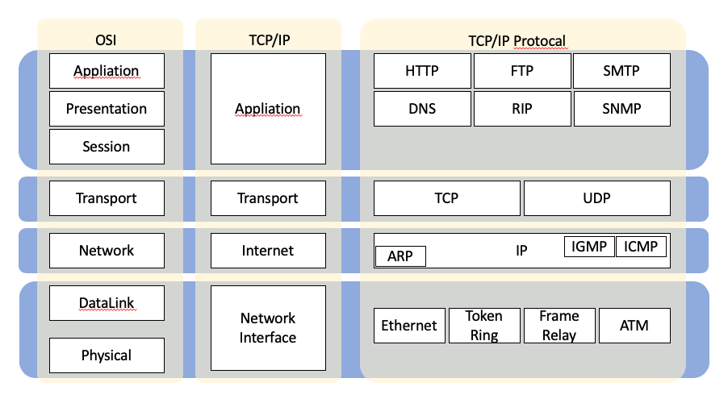
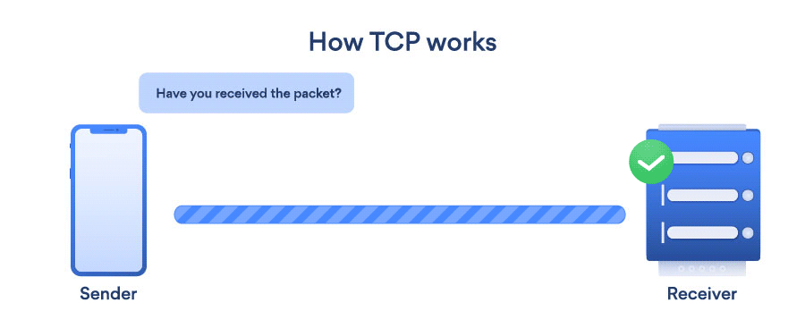
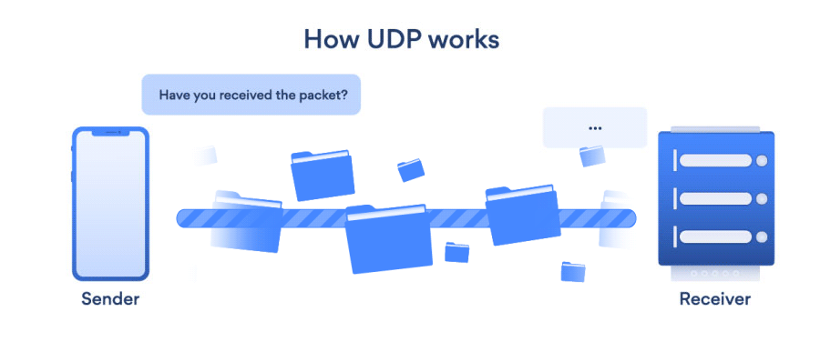
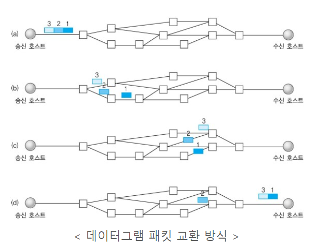
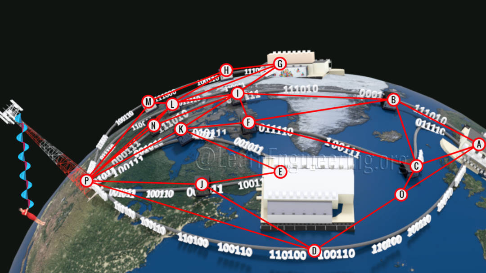
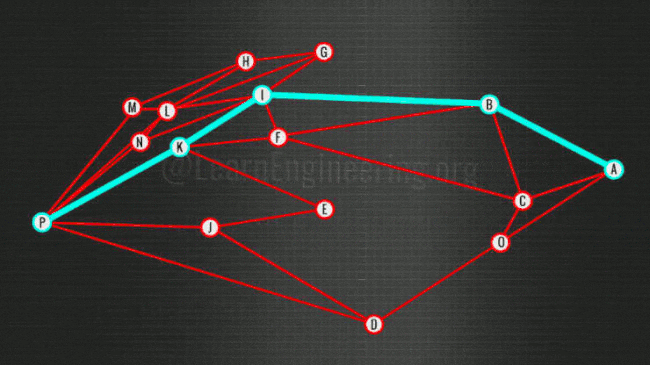

#### 네트워크 모델은 2가지가 있다. </br> 국제 표준화 기구 (IOS)에서 만든 OSI 7 Layer </br> 미국 국방부 (DoD)에서 만든 TCP/IP 4계층 모델

<div align=center>
  
</div>

---

## 🌐 OSI 7 Layer

#### 물이네전선표 : 물리, 데이터, 네트워크, 전송, 세션, 표현, 응용
1. 케이블, 스위치 등 물리적 장치임
2. 한 장치에서 다른 장치로
3. **IP Address**를 사용해 시작점과 목적지 까지 경로 배정 여러 가지 선택지 중에서 하나의 길을 결정 (IP)
4. **Port Number**로 발신지-목적지 두가지 프로세스 통신 (TCP / UDP)
5. 두 기기 사이 통신을 시작하고 종료하는 일을 담당, 세션 개방시에만 데이터 교환이 가능 (SSH, TLS)
   * 사용자가 브라우저를 닫아 서버와의 연결을 끝내는 시점까지를 세션이라고 합니다.  
   * 세션(session)이란 웹 사이트의 여러 페이지에 걸쳐 사용되는 사용자 정보를 저장하는 방법을 의미합니다.
6. 데이터 변환, 암호화, 압축 담당 (JPEG, MPEG)
7. 프로그램 구현체와 사용자의 데이터가 직접 상호작용하는 유일한 계층임 (HTTP, FTP, DNS)
#### 프로토콜 : 네트워크로 데이터를 교환하기 위해 사용하는 통신 규칙과 약속.

---

## 🌐 TCP/IP 4계층 모델

|Layer Number	| Layer Name	| Addressing |	Protocol Data Unit |	Protocol|
|---|---|---|---|---|
|L5	          | Application	| - | Message	| HTTP, SSH, FTP, SMTP, POP, DNS |
|L4	          | Transport	| Port Number	| Segment, Datagram |	TCP, UDP |
|L3	          | Network	| IP Address	| Packet |	IP |
|L2	          | Link	| MAC Address |	Frame	| IEEE 802, Ethernet, Wi-Fi |


---

> ### 📄 1. 응용 계층

#### 1). 개요

* Message (Json, XML...) 같은 데이터 유닛을 사용
* 프로그램 구현체와 사용자의 데이터가 직접 상호작용하는 유일한 계층임
  EX). 웹 브라우저(크롬, 파이어 폭스), 소프트웨어 애플리케이션
  
#### 2). 프로토콜

##### ① HTTP/HTTPS
```
주로 웹서버와 클라이언트 통신에서 사하며
상태를 유지하지 않고, 비 실시간이고 오직 요청/응답 으로 작동한다.
1. html/json을 주고받기 위한 규약
2. 요청종류는 CRUD, Create, Read, Update, Delete
3. 사용 메소드는 Get, Post가 주로 사용되는것으로 알고 있습니다.
4. 또한 상태코드를 받아 에러 핸들링을 하기도 합니다.
```

##### ② FTP
```
인터넷 상의 컴퓨터들 간에 파일을 교환하기 위한 표준 인터넷 규약. 
인터넷에서 사용되는 리소스들을 업로드 하기 위한 공간으로 
게임에서 사용되는 리소스들을 FTP에 업로드 하여 실제 게임에서 로드하여 사용한다.
```

##### ③ DNS
```
웹사이트 접속에 서버와 클라이언트 동작 할떄
DNS라는 전 세계급 서버를 통해 
URL 주소값을 가져온다.

DNS는 IP와 도메인 서로서로 변환한다.
IP : 192.0.2.1 
도메인 : www.
```

---

> ### 📄 2. 전송 계층

#### 1). 개요


* **Port Number**로 발신지-목적지 두가지 프로세스 통신
  1. 정보를 분할하고 다시 합치는 과정을 담당한다.
  2. 흐름제어 : 전송 속도 결정
  3. 오류 제어 : 수신되지 않응ㄴ 경우 재전송
* 데이터 유닛은 Segment(TCP) Datagarm(UDP)를 사용

#### 2). 프로토콜


##### ① TCP

<div align=center>
  
  
</div>

1. **신뢰성** : 흐름 제어로 순서 보장을 하며 오류 제어를 통해 신뢰성 보장한다
2. **연결성** : 상태를 유지하는 양방향 연결성
    * 연결설정 : 3-way handshaking : 목적지와 수신지를 확실히 하는 과정
    * 연결해제 : 4-way handshaking 
3. **경로** : 연결에 대한 논리적인 경로가 무조건 있다 그래서 패킷은 지정된 경로로 다닌다
4. **재전송** : handshaking 과정에서 오류 발생시 재전송함.
5. **속도** : 비교적 느림

##### ② UDP

<div align=center>
  
  
</div>

1. **신뢰성** : 순서 보장 안하고 무차별적인 전송
2. **연결성** : 비연결성이기 떄문에 정보를 보낸다/받는다" 에 대핸 신호 절차가 없다
3. **경로** : 연결에 대한 논리적인 경로가 없다 (데이터 그램)패킷은 독립적으로 다른 경로로 통해 전달된다
4. **재전송** : 재전송 없음
5. **속도** : 고속 전송 가능

---

> ### 📄 3. 네트워크 계층

#### 1). 개요

<!-- ##### [패킷이란](./패킷.md) -->

* **IP Address**를 사용해 시작점과 목적지 까지 경로 배정
  * 여러 가지 선택지 중에서 하나의 길을 결정
* 여기서 사용하는 장비가 바로 라우터다. 또한 "패킷 운반"하는 일을한다. 
* 패킷이 Host에 도착하면 Routing Table에 지정된 경로로 패킷을 Forwarding한다.

#### 2). 라우팅

* ##### HTTP 요청(메서드 + URL 등)에 대해 서버가 어떤 코드를 실행할지 결정하는 과정
<div align=center>
  
  
</div>


* “경로 + 메서드 → 서버 처리 로직 매핑”
*어떤 요청은 A, 어떤 요청은 B 각각의 요청을 분배하는것이 바로 라우팅.*
  ```js
  app._METHOD_(PATH : 경로, HANDLER : _실행하고싶은 함수 콜백방식으로 작동_);
  // 즉, 
  //     경로 A에 대해서는
  //         HANDER_A를 실행하도록,
  //     경로 B에 대해서는
  //         HANDER_B를 실행하도록
  // 할 수 있다.
  ```

* 즉 URL에 HTTP 메서드가 `Get`, `Post`라도 서로 다른 URL 경로 주소별로 다른 행동을 하게 된다.
  * URL 패턴에 대해 HTTP 메서드가 매핑되어 있고.
  * 그 URL 경로를 `/` 기준으로 파싱해
    * 핸들러(Controller, Action 등) 매핑된 함수를 호출하는 과정을 말함
 

#### 3). 프로토콜

##### ① IP


---

> ### 📄 4. 링크 계층

#### 1). 개요

* **Mac Address**를 사용해 네트워크 카드의 물리적인 주소를 식별한다.
* 물리계층에서는 **모든 데이터의 송수신은 바이트 배열로 이루어짐**
  * `Byte[]배열`로 디코딩/인코딩 과정

#### 2). 프로토콜
##### 이더넷,  Wifi,  Bluetooth

---

## 참고

#### 1. [OSI 모델이란?](https://www.cloudflare.com/ko-kr/learning/ddos/glossary/open-systems-interconnection-model-osi/)
