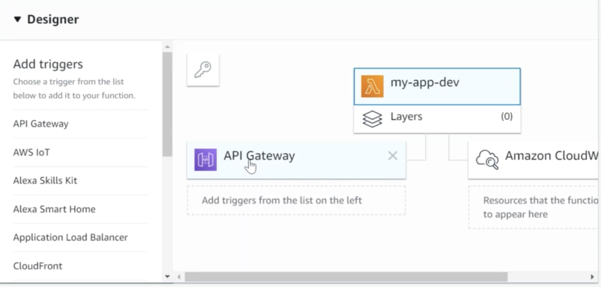

## 🍷 1 AWS Enviroment

---

> ### 📄 AWS console

1. AWS 가입하고
2. IAM(Identity and Access Management) User 생성
   * 생성시 직업 정책 연결 
   * AdministratorAceess 선택
3. IAM 사용자의 Security Credentials 클릭
   
   * 엑세스키 (CLI)
    
4. Download Access Key ID and Secrete Key ID
    

*Enviroment Variable 또는 Tag?*

---

> ### 📄 aws-cli 설치

1. 사이트 가서 지침 따라서 다운하기
2. `aws configure`
    ```bash
    code ~/.aws/config
    [default]
    aws_access_key_id=YOUR_ACCESS_KEY_HERE
    aws_secret_access_key=YOUR_SECRET_ACCESS_KEY
    region=YOUR_REGION #(예시로.. ap-northeast-2, us-west-2, us-west-1, etc)
    ```
3. 여기까지하면 AWS 에명령을 내릴 수 있는 환경이 구성되었다.
4. 유저와 엑세스 키 확인
   ```bash
   aws sts get-caller-identity
   > 
    {
        "UserId": ...,
        "Account": ...,
        "Arn": ...
    }
   ```

---

> ### 📄 3. 디자이너


트리거나 리소스를 바인딩하여 서비스를 디자인 할 수 있다.

---

> ### 📄 4. App Runner
* 컨테이너화 된 앱

---

### 참고

[AWS CLI](https://aws.amazon.com/ko/cli/)

[파이썬 Chalice를 이용한 서버리스 이미지 호스팅 제작기](https://hidekuma.github.io/python/chalice/serverless/python-chalice/)

[AWS 개발환경](https://www.youtube.com/watch?v=alFztoL4ojE&list=PLv30Wx8ctrjPN3_LpAqATkuh9F79QW1qJ&index=2)