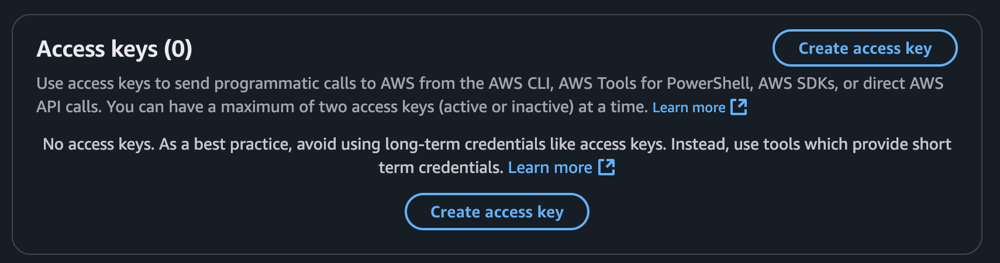
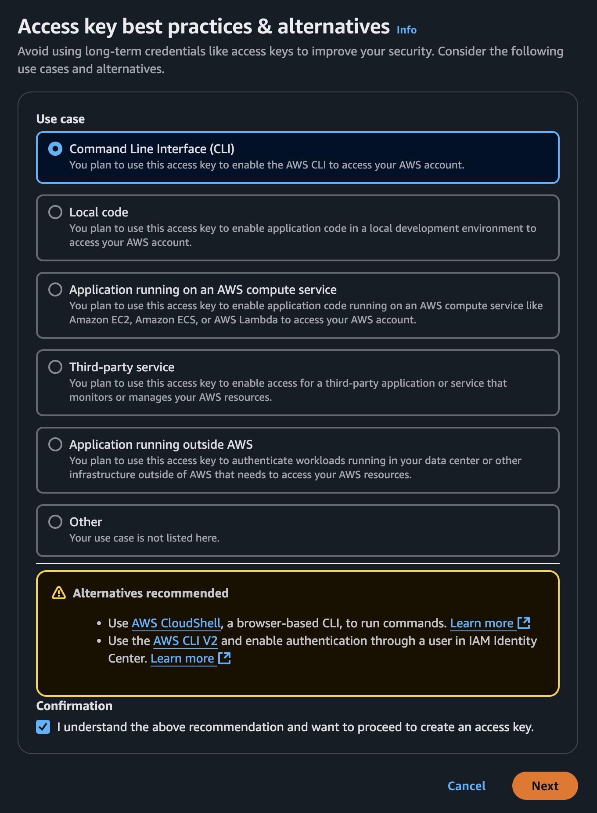
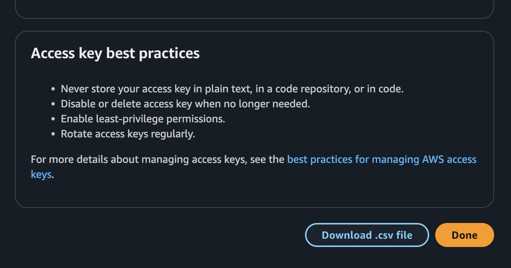

## 🍷 1 AWS Environment

---

> ### 📄 1. AWS 계정 보안

#### AWS 가입이 끝났으면 보안 활성화와 IAM User 생성이 필요하다.

#### 1). root user

root user는 AWS 계정을 만들면 생기는 사용자다. 권한 수준이 제일 높음

#### 2). long-term user

* 일명 IAM(Identity and Access Management) 에서 만든 사용자.
* 엑세스 제어 정책을 제공하며, 보안 인증 정보가 각각 할당되는 사용자.
* 생성시 작업 정책 연결 
   * AdministratorAceess 선택

* IAM 사용자의 Security Credentials 클릭
   

---

> ### 📄 2. aws-cli 세팅

#### CLI 혹은, 스크립팅으로 엑세스하는 방식 세팅하기.
일반적으로 이 설정을 하지 않으면 AWS Management Console GUI로 설정 가능하지만
CLI, SDK 접근이 가능하면 로그인, 서비스 활성화 등등 자동화가 가능해 진다.

#### 1). IAM CLI 엑세스 키 생성

##### ① 엑세스키 (CLI)
* 

##### ② Download Access Key ID and Secrete Key ID
* 

##### ③ CLI 설치
1. `aws configure`
    ```bash
    code ~/.aws/config
    [default]
    aws_access_key_id=YOUR_ACCESS_KEY_HERE
    aws_secret_access_key=YOUR_SECRET_ACCESS_KEY
    region=YOUR_REGION #(예시로.. ap-northeast-2, us-west-2, us-west-1, etc)
    ```
2. 유저와 엑세스 키 확인
   ```bash
   aws sts get-caller-identity
   > 
    {
        "UserId": ...,
        "Account": ...,
        "Arn": ...
    }
   ```
3. 여기까지하면 CLI로 AWS에 명령을 내릴 수 있는 환경이 구성되었다.
또한 AWS SDK for python `botocore`를 사용해서 스크립팅환경 또한 가능하다.

---

> ### 📄 3. 디자이너


트리거나 리소스를 바인딩하여 서비스를 디자인 할 수 있다.

---

### 참고

* [AWS CLI](https://aws.amazon.com/ko/cli/)
* [파이썬 Chalice를 이용한 서버리스 이미지 호스팅 제작기](https://hidekuma.github.io/python/chalice/serverless/python-chalice/)
* [AWS 개발환경](https://www.youtube.com/watch?v=alFztoL4ojE&list=PLv30Wx8ctrjPN3_LpAqATkuh9F79QW1qJ&index=2)