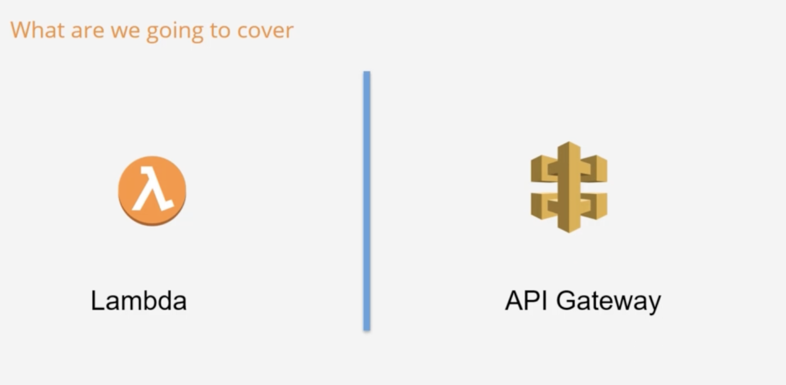
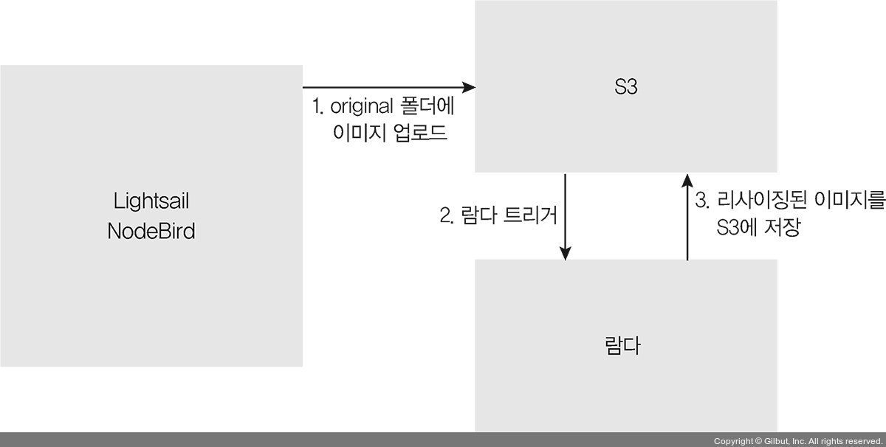

## 🍷 2 Serverless 

---

#### AWS 컴퓨팅 서비스
* EC2, Lightsail, Elastic Beanstalk 등등..과 같은 서비스다.



---

### 📄 1. 서버리스 이해하기
* VM 인스턴스를 미리 구매하지 않아도 되며 서버필요 없이 단순히 코드만 배포.
* 함수 실행 시 100ms 단위 사용량에 따라 요금을 지불
상시 작동할 필요가 없는 서버인 경우, 서버리스 "컴퓨팅"을 사용하면 필요한 경우에만 실행되어 요금을 절약 가능
* 높은 확장성 및 빠른 서비스 연동

#### 1). 가상 컴퓨팅 기술 비교 

|/|Packaging|Updates|Execution|Runtime|Unit of Cost|
|---|---|---|---|---|---|
|VMs|AMI|Patching|Multi-threaded & Multi-task|하루에서 몇달동안 작동|VM개수당 & 시간당|
|Containers|Container File|Versioning|Multi-threaded & single-task|분에서 하루 동안 작동|VM개수당 & 시간당|
|Serverless|Code|Versioning|Single-threaded & single-task|아주작은 클럭 타임|사용 메모리당 리퀘스트 당|

#### 2). AWS Lambda 동작 원리

##### ① 단순한 자원 모델
* 메모리 사이즈 설정 가능 128MB ~ 1.5GB 까지!
##### ② 유연한 호출 경로
* Event 기반 호출 옵션 (S3 같은 서비스들..)
* REST API 호출 가능 (API Gatewat 콜과 연동)

##### ③ 효과적인 권한 통제
* Virtual Private Cloud(사설 네트워크) 연동 및, IAM Role을 사용한 실행 권한 설정
* AWS 이벤트 소스에 대한 다양한 리소스 정책


---

### 2. 서버리스 서비스



1. 파일 처리
   * S3 스토리지에 파일이 업로드됨에 트리거를 AWS Lambda로 등록할 수 있다. 
2. 웹 애플리케이션 
   * 고가용성을 제공하고, 서버의 스케일 업/다운이 용이한 서비스 구축 가능
3. 모바일 백엔드
4. A/B 테스트
5. 크롤러 또는 봇 신속 처리

---

### 3. 주요 기능
```
환경 변수
환경 변수를 사용하여 코드를 업데이트하지 않고 함수의 동작을 조정합니다.

버전
예를 들어 안정적인 프로덕션 버전의 사용자에게 영향을 주지 않고 베타 테스트에 새 함수를 사용할 수 있도록 버전으로 함수 배포를 관리합니다.

컨테이너 이미지
기존 컨테이너 도구를 재사용하거나 기계 학습과 같은 상당한 종속 구성 요소에 의존하는 더 큰 워크로드를 배포할 수 있도록 AWS에서 제공하는 기본 이미지 또는 대체 기본 이미지를 사용하여 Lambda 함수에 대한 컨테이너 이미지를 생성합니다.

계층
라이브러리와 기타 종속 구성 요소를 패키징하여 배포 아카이브의 크기를 줄이고 코드를 더 빠르게 배포할 수 있도록 합니다.

Lambda 확장
모니터링, 관측성, 보안 및 거버넌스를 위한 도구로 Lambda 함수를 보강합니다.

함수 URL
Lambda 함수에 전용 HTTP(S) 엔드포인트를 추가합니다.

응답 스트리밍
Node.js 함수에서 클라이언트로 응답 페이로드를 다시 스트리밍하여 첫 번째 바이트까지 시간(TTFB) 성능을 개선하거나 더 큰 페이로드를 반환하도록 Lambda 함수 URL을 구성합니다.

동시성 및 크기 조정 컨트롤
프로덕션 애플리케이션의 크기 조정 및 응답성에 대해 세밀한 제어를 적용합니다.

코드 서명
승인된 개발자만 변경되지 않은 신뢰할 수 있는 코드를 Lambda 함수에 게시하는지 확인합니다.

프라이빗 네트워킹
데이터베이스, 캐시 인스턴스, 내부 서비스 등의 리소스에 대해 프라이빗 네트워크를 생성합니다.

파일 시스템 액세스
함수 코드가 높은 동시성으로 안전하고 공유 리소스에 액세스하고 수정할 수 있게 Amazon Elastic File System(Amazon EFS)을 로컬 디렉터리에 탑재하도록 함수를 구성합니다.
```
---

### 3. AWS Lambda 세팅

1. "Create Function"으로 "Function"을 만들 수 있음
2. 런타임 환경을 정해줘야 하고
3. 코드의 사이즈 
4. AWS Lambda - Environment Variables
5. AWS Lambda - Modules


#### 1). Lambda Management Console
1. AWS Environment 만 설정 한다면 Function 코드를 직접 웹에서 수정할 수 있다.


---

### 참고

* [서버리스 이해하기](https://thebook.io/080334/0548/)
  