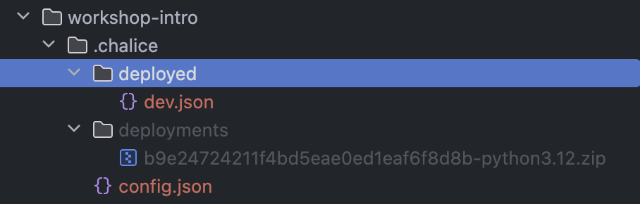
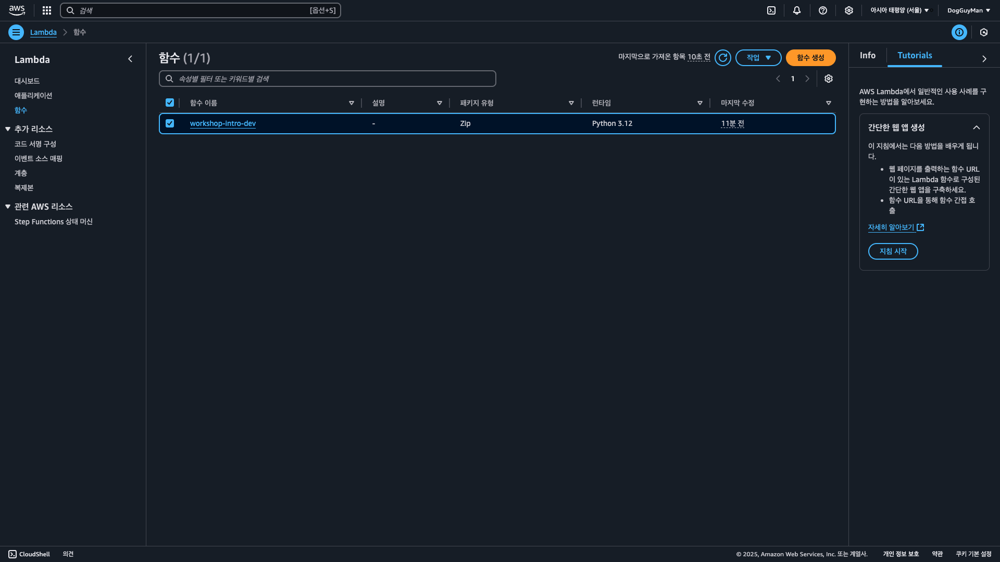
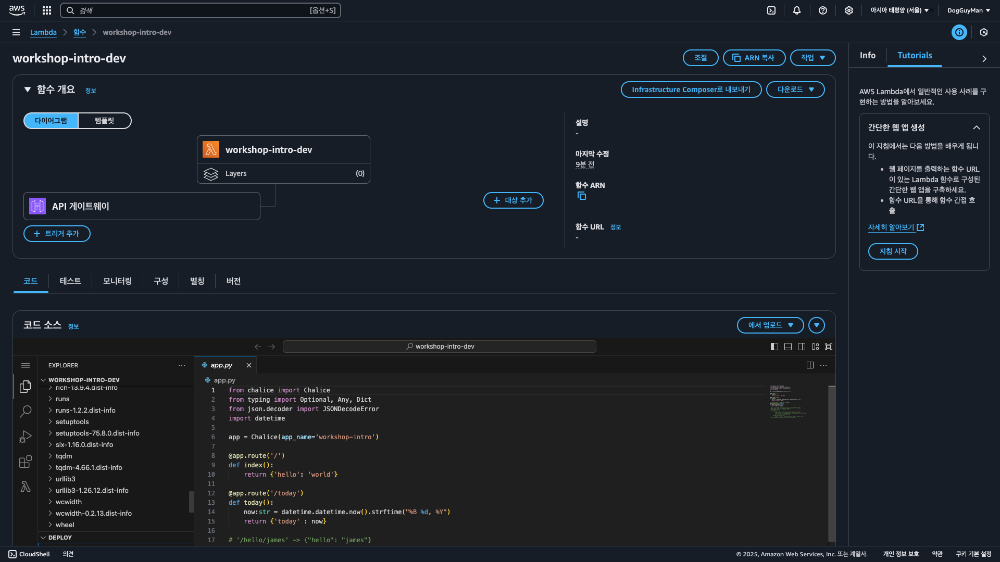
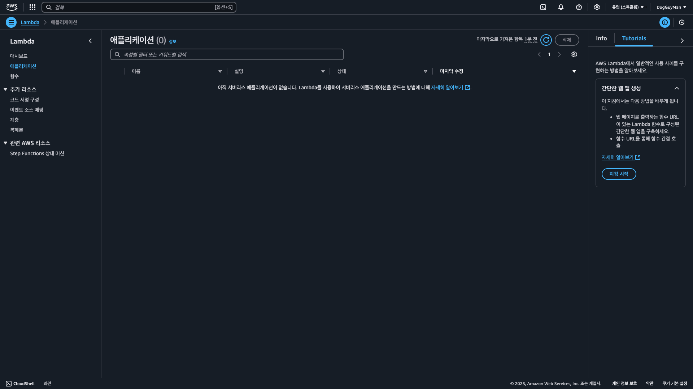
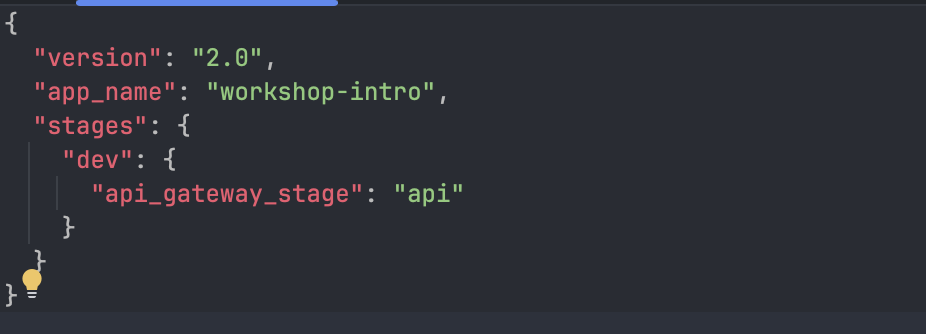
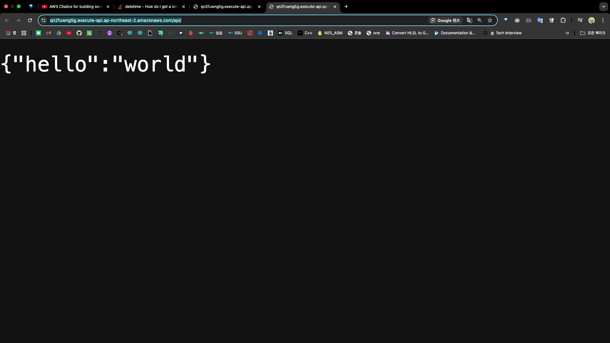
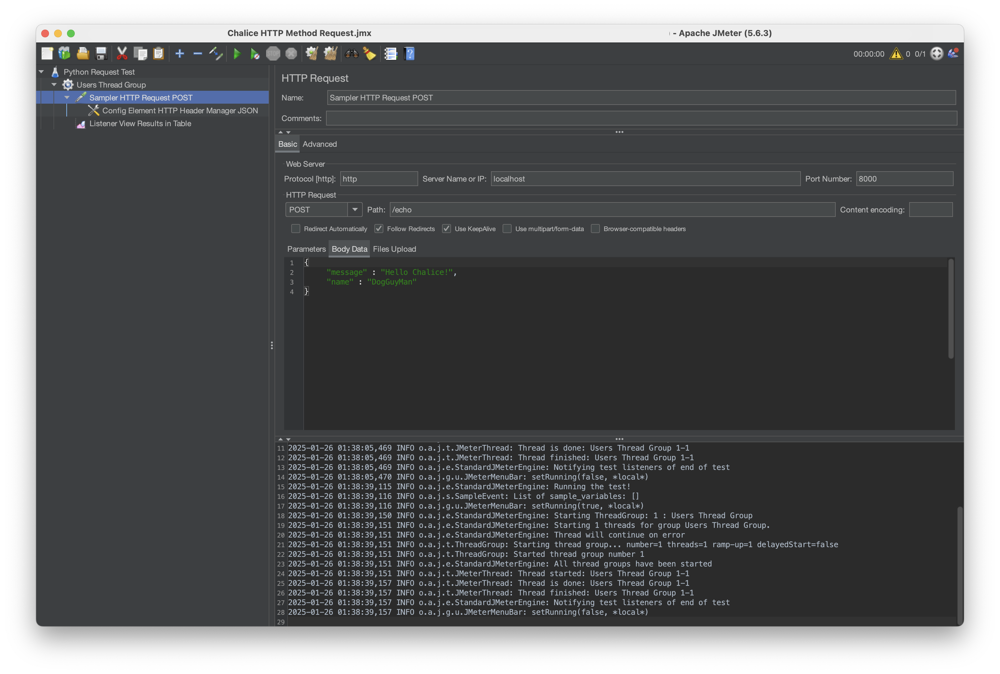
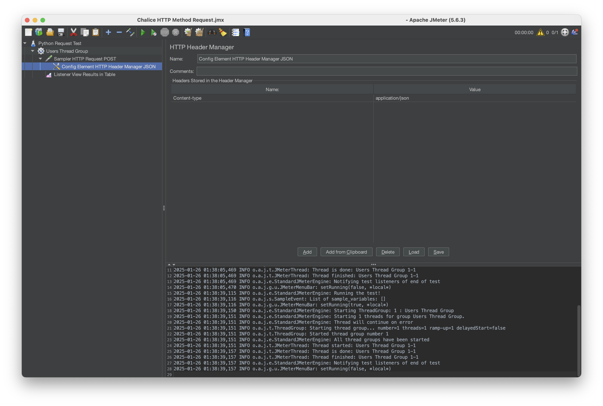
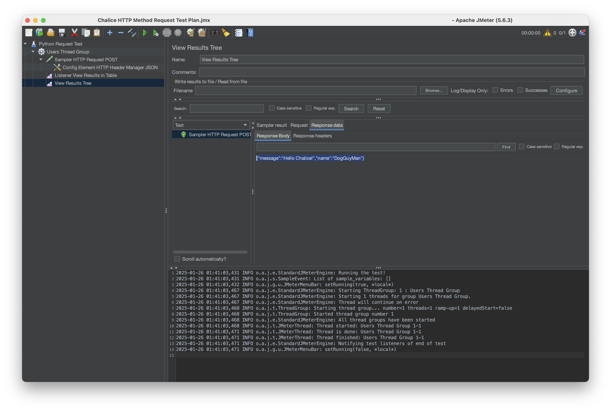
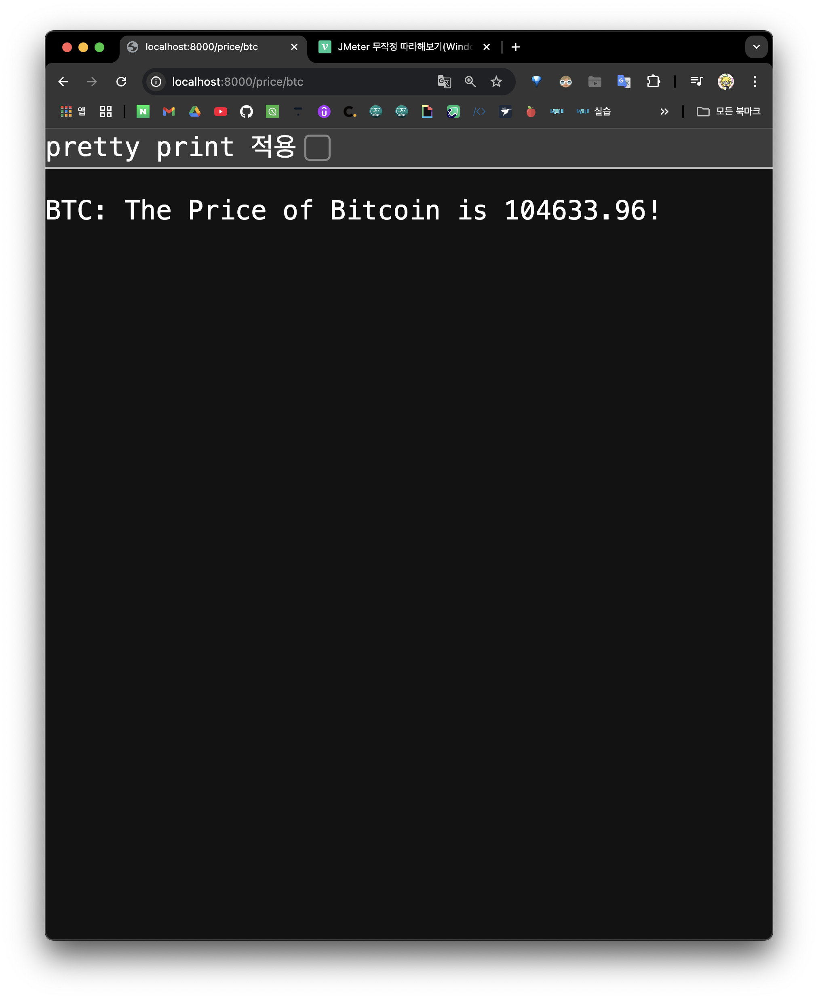

## 🍷 3  Python Chalice

---

> ### 📄 1. AWS Chalice란?
AWS Chalice는 AWS의 오픈 소스 서버리스 프레임워크로 빠르고 쉽게 서버리스 어플리케이션을 구축할 수 있습니다. Flask 스타일의 마이크로 웹 프레임워크를 기반으로 하고 있으며, **자동으로 AWS Lambda 함수를 생성**하고 **API Gateway 엔드포인트를 구성**해 줍니다. 또한 **Amazon DynamoDB, Amazon S3, SQS, SNS 등과 같은 서비스의 통합**도 지원합니다.

Chalice는 간단한 웹 애플리케이션 및 마이크로 서비스와 같은 작은 규모의 빠른 프로토타이핑 및 서버리스 애플리케이션 개발에 유용하며, 데이터 과학자가 Lambda 및 API Gateway와 같은 AWS 서비스에 대한 지식이 없더라도 쉽게 사용할 수 있습니다. 또한 Chalice는 일부 내장된 보안 기능, 로깅 및 오류 처리 기능을 제공하므로 개발자는 이러한 작업을 직접 처리할 필요가 없습니다.

---

> ### 📄 2. Chalice 세팅
#### 1). Chalice 설치
```bash
pip install chalice
chalice --help
# Verify Chalice
chalice --version
```

#### 2). 프로젝트 생성
```shell
PROJECT = "hello-world"
chalice new-project $PROJECT
```

#### 3). 로컬 서버 
```bash
chalice local --port=8100
# curl(client url) 명령어는 프로토콜들을 이용해 
# URL로 데이터를 전송해 서버에 데이터를 보내거나 
# 가져올 때 사용하기 위한 명령줄 도구 및 라이브러리입니다.
# curl <url> : url에 request를 할 수 있는 명령어
curl localhost:8100
```

#### 4). 서버 배포

##### REST API URL : 생성하기

```bash
chalice deploy # 코드 바뀔때 마다 수행해야한다.
> 
Creating deployment package.
Creating IAM role: workshop-intro-dev
Creating lambda function: workshop-intro-dev
Creating Rest API
Resources deployed:
  - Lambda ARN: arn:aws:lambda:...  
  - Rest API URL: https://...

curl https://ojl2xoqdkf.execute-api.ap-northeast-2.amazonaws.com/api/
> {"hello":"world"}%    
```

##### deploy 파일을 올리고 싶으면 `aws configure` 셋업을 해야한다.
* 
* 테이블
  |배포 전|배포 후|
  |---|---|
  |||
* 

##### AWS Console이 갱신이 안되는 이유
* 주의할점! 만약 AWS Configure Region이 다른곳으로 되어 있으면
아무리 Chalice 배포를 해도 갱신이 안됨! 따라서 국가 확인을 꼭! 합시다.
  


##### 'api_gateway_stage : "api"' 의  의미
* 
* 
* `https://...com/api/` 의 api를 말한다. 그래서 이걸 "/dev/"로 바꾸면 dev로 접속해야 한다.

#### 5). 로깅과 디버깅
```bash
chalice logs --num-entries 2
> 
2025-01-23 18:31:03.298000 4b3bbd INIT_START Runtime Version: python:3.12.v38   Runtime Version ARN: arn:aws:...
2025-01-23 18:34:42.945000 3a9284 INIT_START Runtime Version: python:3.12.v38   Runtime Version ARN: arn:aws:...
```

#### 6). 챌리스 삭제
```bash
chalice delete
```

##### `chalice delete` 에러 해결법
* 가끔 삭제가 안되는 상황이 있는데
  ```
  chalice delete
  Traceback (most recent call last):
    File "/Users/escatrgot/Develop Projects/PythonProject/PythonServerless/.venv/lib/python3.12/site-packages/chalice/cli/factory.py", line 176, in create_config_obj
      config_from_disk = self.load_project_config()
                         ^^^^^^^^^^^^^^^^^^^^^^^^^^
  :
  :
  :
    File "/Users/escatrgot/Develop Projects/PythonProject/PythonServerless/.venv/lib/python3.12/site-packages/chalice/cli/factory.py", line 183, in create_config_obj
      raise RuntimeError(
  RuntimeError: Unable to load the project config file: Expecting property name enclosed in double quotes: line 7 column 5 (char 119)
  ```
* `config.json`에 오타가 있는지 확인하자.
  ```json
  "stages": {
    "dev": {
      "api_gateway_stage": "api", // ❌ 콤마(,) 지우기
    } 
  }
  ```

#### 7). 본인 라이브러리 추가하기
* 꼭 "chalicelib"라는 이름으로 라이브러리 디렉토리를 추가하자
  ```bash
  .
  ├── app.py
  ├── chalicelib            ✅
  │   ├── __init__.py
  │   └── greeting_model.py
  ├── readme.md
  ├── requirements.txt
  └── sam.json
  ```
* 이렇게 만든 디렉토리에 본인만의 클래스 구조를 짜고 
  import 해주면 된다.
  ```py
  # app.py 내부에서 
  ...
  from chalicelib.<lib_name> import <import_name>
  ...
  ```

#### 8). HTTP 메서드
* JMeter로 HTTP 리퀘스트 보내기
  
  
  
* [리퀘스트 파일](./JMeter/Chalice%20HTTP%20Method%20Request%20Test%20Plan.jmx)

#### 9). .env, secrets.py를 통한 API_KEY 은닉


---

### Quick Start

* [Chalice Build Serverless Apps](https://www.youtube.com/watch?v=3BtVE7-N3ig&t=1s)
* [AWS Chalice Examples](https://github.com/daekeun-ml/aws-chalice-examples/tree/main)
* [Chalice Doc](https://aws.github.io/chalice/)
* [Chalice Quickstart](https://aws.github.io/chalice/quickstart.html)
* [Introduction to AWS Chalice](https://chalice-workshop.readthedocs.io/en/latest/todo-app/part1/00-intro-chalice.html)
* [파이선(Python) 개발자를 위한 AWS 활용 - Youtube ](https://www.youtube.com/watch?v=0rkRvEr9RMk)
* [파이선(Python) 개발자를 위한 AWS 활용 - slideshare](https://www.slideshare.net/awskorea/recap2016-1pythononaws)
* [Using Python Chalice and AWS Lambda](https://www.youtube.com/watch?v=r60-90Stb2o&list=PLIMQzWccmG7b_jT32v7hA-SzrzjnjXqEl&index=53)
* [Walkthrough of the Media Query Sample Application](https://www.youtube.com/watch?v=UCZXJpI1dKw&t=278s)