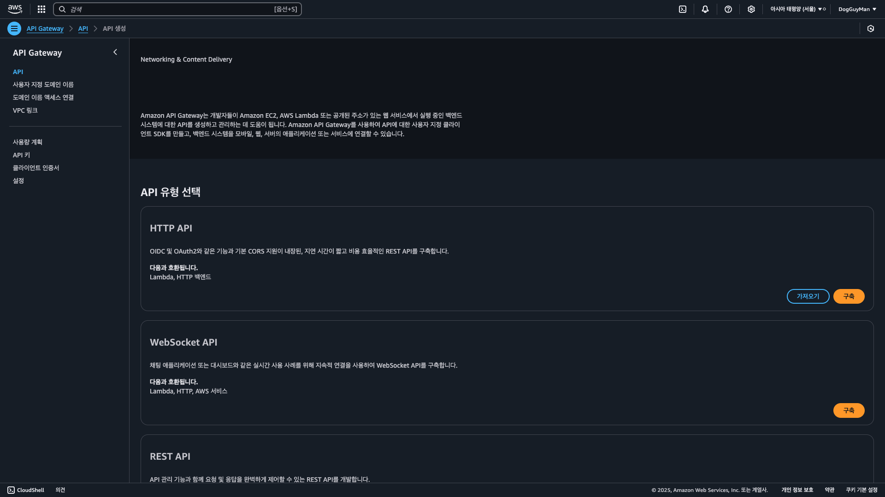
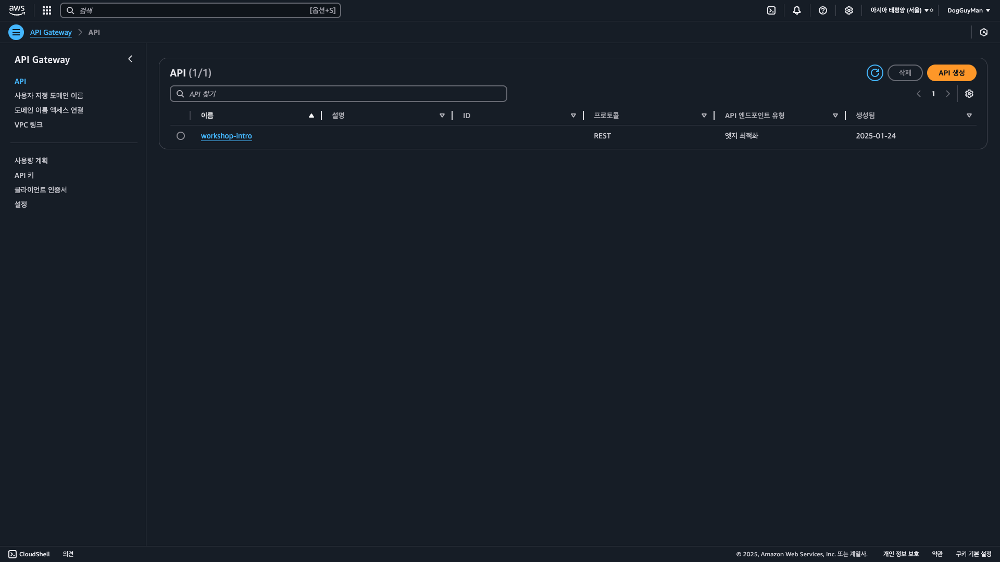
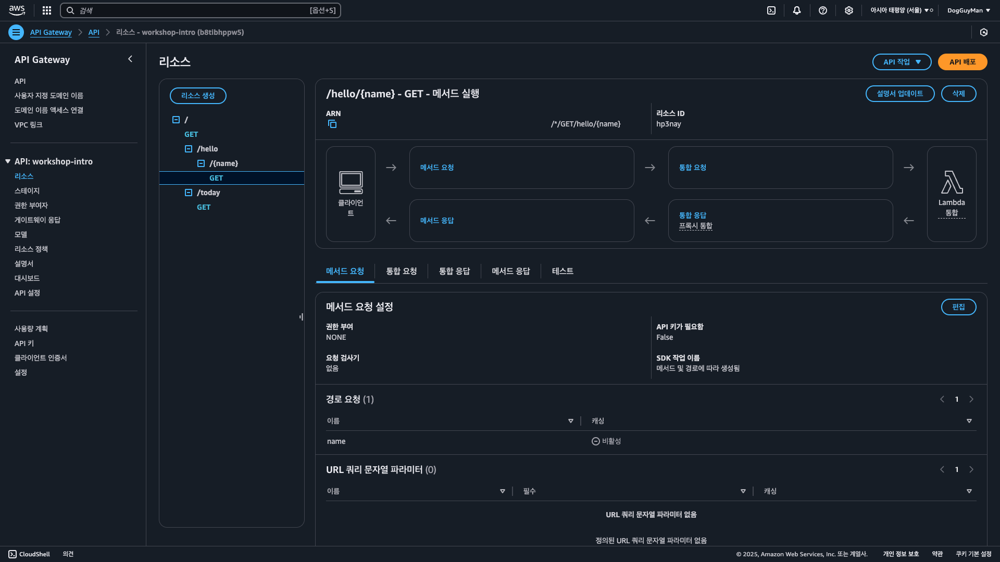

## 🍷 4 Amazon API Gateway

---

#### AWS 네트워킹 및 콘텐츠 전송 서비스
* VPC, CloudFront 등등... 과 같은 서비스다.


> ### 📄 1. 설명

#### Amazon API Gateway로 RESTful API를 생성하고 관리할 수 있음

애플리케이션이 돌아가는 클라이언트와 백엔드 마이크로 서비스 사이에 위치한다.

```
1. API를 이루는 
   1. Resources
   2. Stages
   3. Authorizers
   4. Gateway Responses
   5. Models
   6. Resource Policy
2. API Endpoint 마다 Method `GET`에 대해 어떻게 실행할 것인지 이런것을 UI로 설정 가능하다.
```

#### 1). Working With API Gateway Method

1. Query String Parameters
2. Post Method
3. Configuration
4. Using POSTMAN Tool

#### 2). API Gatewate Security
1. API Key
2. Lambda Authorizer

```
client send request to API Gateway RESTAPI
invoke lambda function that query dynamoDB 
http response back to client
```

> ### 📄 2. Chalice와 연동
* 배포시 AWS Lambda 와 같이 아래와 같은 형태로 Gateway API가 형성된 것을 확인할 수 있다.
   |배포 전| 배포 후|
   |---|---|
   |||

* 리소스의 라우트 경로마다 HTTP Method(GET, POST, PUT, DELETE)가 연결 된 것을 확인할 수 있다.


> ### 참조
* [ Amazon API Gateway Doc](https://docs.aws.amazon.com/ko_kr/apigateway/latest/developerguide/welcome.html)
* [API Gateway](https://blog.bytebytego.com/p/api-gateway)
* [What is API Gateway? youtube](https://www.youtube.com/watch?v=6ULyxuHKxg8&t=12s)
