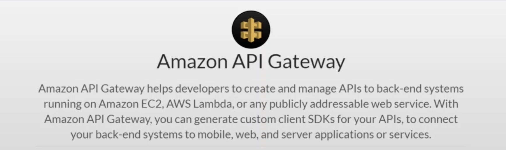

## 🍷 4 Amazon API Gateway

---

> Amazon API Gateway로 RESTful API를 생성하고 관리할 수 있음

1. API를 이루는 
   1. Resources
   2. Stages
   3. Authorizers
   4. Gateway Responses
   5. Models
   6. Resource Policy
2. API Endpoint 마다 Method `GET`에 대해 어떻게 실행할 것인지 이런것을 UI로 설정 가능하다.

#### 1). Working With API Gateway Method

1. Query String Parameters
2. Post Method
3. Configuration
4. Using POSTMAN Tool

#### 2). API Gatewate Security
1. API Key
2. Lambda Authorizer

### 참조
[ Amazon API Gateway란 무엇입니까?](https://docs.aws.amazon.com/ko_kr/apigateway/latest/developerguide/welcome.html)
